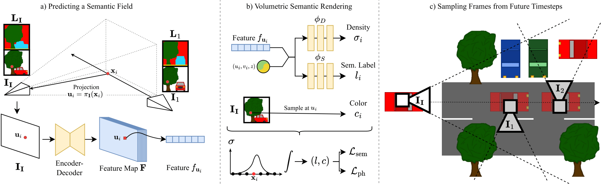
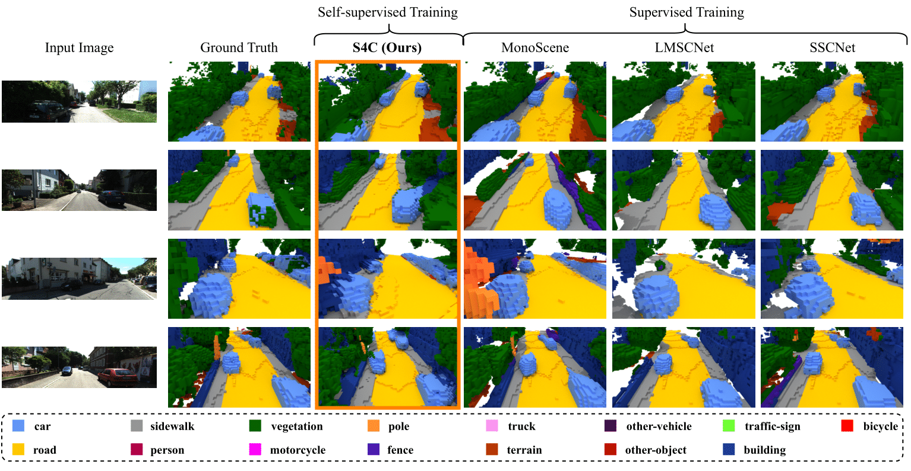
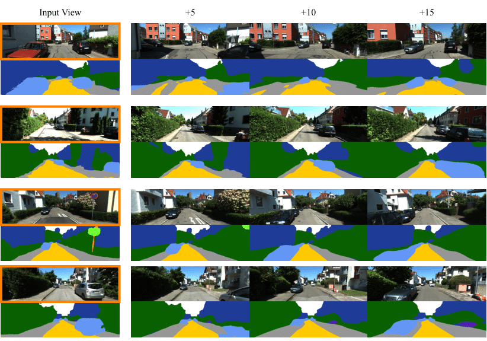

<video width="100%" autoplay muted loop>
  <source src="./assets/header_video.mp4" type="video/mp4">
Your browser does not support the video tag.
</video>

***Video 1. SSC Predictions on KITTI-360.** Input image (top), color-coded voxel grids (bottom). The voxels indicate if a certain region is occupied or not, the color indicates the class. A color to class map can be found in Figure 2. We compare the predictions of our S4C against the ground truth and other fully supervised state-of-the-art methods. The current method is displayed in the bottom left corner.*

# Abstract

Our proposed method can reconstruct a scene from a single image and only relies on videos and pseudo segmentation ground truth generated from off-the-shelf image segmentation network during training.
\
Unlike existing methods, which use discrete voxel grids, we represent scenes as implicit *semantic fields*.
This formulation allows querying any point within the camera frustum for occupancy and semantic class.
Our architecture is trained through rendering-based self-supervised losses.
\
Nonetheless, our method achieves performance close to fully supervised state-of-the-art methods.
Additionally, our method demonstrates strong generalization capabilities and can synthesize accurate segmentation maps for far away viewpoints.

# Method

***Figure 1. Overview.** **a)** From an input image $\textbf{I}_\textbf{I}$, an encoder-decoder network predicts a pixel-aligned feature map $\textbf{F}$ describing a semantic field in the frustum of the image. The feature $f_{\textbf{u}_i}$ of pixel $\textbf{u}_i$ encodes the semantic and occupancy distribution on the ray cast from the optical center through the pixel. **b)** The semantic field allows rendering novel views and their corresponding semantic segmentation via volumetric rendering. A 3D point $\textbf{x}_i$ is projected into the input image and therefore $\textbf{F}$ to sample $f_{\textbf{u}_i}$. Combined with positional encoding of $\textbf{x}_i$, two MLPs decode the density of the point $\sigma_i$ and semantic label $l_i$, respectively. The color $c_i$ for novel view synthesis is obtained from other images via color sampling. **c)** To achieve best results, we require training views to cover as much surface of the scene as possible. Therefore, we sample side views from random future timesteps, that observe areas of the scene that are occluded in the input frame.*

We train our model using muti-view consistency i.e. how does my scene look from different views given the 3D understanding predicted from a singular input image. This self-supervised manner differs from other methods that use the 3D ground truth directly. Like in <cite>[BehindTheScences][1]</cite>, we resample colour instead of predicting it. This reduces model complexity significantly, as colour is view-dependent and is strongly influenced by high-frequency components. The reduced complexity enables our model to predict meaningful 3D representations of a scene given only a single RGB input image.
\
In addition, we reconstruct semantic views as part of the training. Unfortunately, we do not have a ground truth for most views used during training. Thus we use a pre-trained off-the-shelf 2D semantic segmentation network to generate imperfect pseudo-ground truths forgoing any 2D semantic segmentation ground truth.
\
Instead of directly predicting an explicit voxel grid like other methods, we use an implicit semantic field (similar to <cite>[NeRF][2]</cite>). These semantic fields can be queried at any point within the camera frustum for occupancy and class distribution. 
\
Hence we can use a semantic field to generate voxel girds for a certain scene (see [Semantic Scene Completion](#semantic-scene-completion)). However, the implicit scene representation affords us additional flexibility. For example, we can generate continuous semantic segmentation maps for unobserved views or denoise existing 2D semantic masks (see [Synthezing Segmentation masks](#synthezing-segmentation-masks)).

# Results

## Semantic Scene Completion

***Figure 2. Predicted voxel grids for SSCBench-KITTI-360.** The qualitative evaluation of our method on occupancy maps shows that our method is able to accurately reconstruct and label the scene. Especially a comparison to other image based methods like MonoScene shows, that **S4C** is able to recover details such as the driveway on the right in image 1. The resulting voxel occupancy from **S4C** shows fewer holes then for Lidar based training, which reproduce holes found in the ground truth.*

We evaluate our method on the novel SSCBench KITTI-360 dataset and display close to state-of-the-art performance both qualitatively and quantitively. This is despite S4C being the only self-supervised method. All other methods rely on the 3D voxel grid during their training process.
\
Out of fairness, we currently exclude <cite>[VoxFormer][4]</cite> from our comparisons, as our reproduction attempts lead to results significantly worse than what was observed in the <cite>[SSCBench][3]</cite> paper. We hope to be able to resolve this issue soon (see <a href="https://github.com/ai4ce/SSCBench/issues/8"> this issue </a>).

## Synthezing Segmentation masks

***Figure 3. Predicted segmentation masks by our model and semantic novel view synthesis.** For the a given input image (marked in orange), we can predict a dense segmentation mask. Additionally, our formulation allows to synthesize segmentation masks for later frames (+5, +10, +15) of the video (10 frames per second). Even when the new view points are far away from the input view, the synthesized segmentation masks are clean and capture the semantics correctly.*

We demonstrate additional use cases for our method. S4C can predict segmentation masks that are more accurate than the pseudo-ground truth it was trained on (label denoising). Also, we can synthesize accurate and continuous semantic masks for viewpoints multiple time steps in the future (the KITTI-360 dataset consists of video sequences). Other methods that produce explicit voxel grids struggle with these tasks due to the discrete nature of their chosen representation.

[1]: https://fwmb.github.io/bts/
[2]: https://www.matthewtancik.com/nerf
[3]: https://github.com/ai4ce/SSCBench
[4]: https://github.com/NVlabs/VoxFormer

